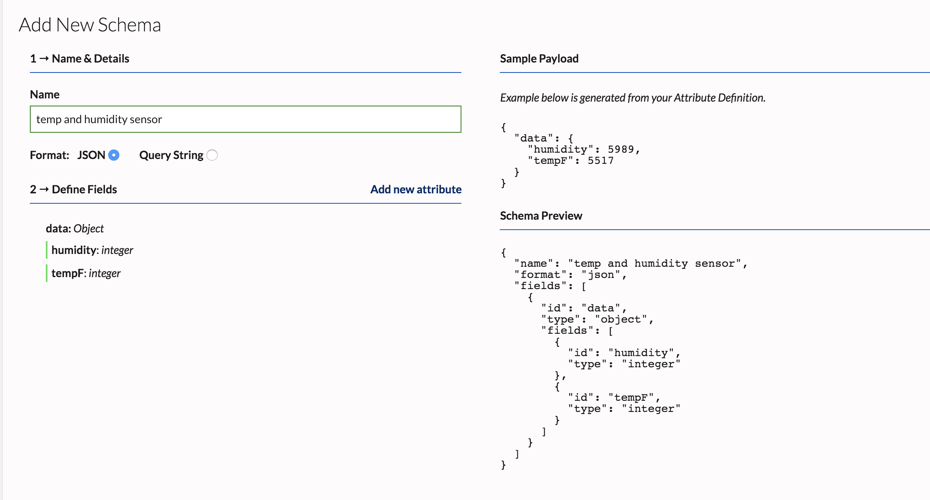

# Schemas

Device data needs to be mapped to fields so you can trigger rules and view analytics. 
This is done using Schemas. Mobile devices (iOS, Android) have predefined schemas that you can use with our SDK a
nd you don’t need to configure them.

For IoT devices you need to first create a custom schema. You can send any kind of data with IoT devices.
It is recommended that you generate IoT schema based on your event payload. 
Once your schema is defined you can use it in a Channel and see data being ingested. 
You can update a schema if necessary at a later time. You will need to include all the 

## Creating a Schema

To create a schema through the dashboard
1. Go to **Channels**
2. In the left sidebar under Schemas, click **+ Add Schema**


3. **Name & Details** - Enter a name for the schema in "Name" field
4. Select **JSON** or **Query String** depending on the schema you wish to create
5. **Define Fields** - Use this section to specify the format of your schema


Here is a simple example:
To define a schema for a JSON payload such as
```json
 "data":{
      "tempF":52,
      "humidity":23
    }
```
add each attribute individually under the **Define Fields** section.

1. Click **Add new attribute**
2. In the **Attribute Location** drop-down, ensure that "root" is selected
3. In the **Attribute Identifier** field, enter "data"
4. In the **Data Type** drop-down, select "Object"
5. Click **Create Attribute** 
Next, add the second attribute named "tempF" the same way:  
6. Click **Add new attribute**
7. In the **Attribute Location** drop-down, select "data"
8. In the **Attribute Identifier** field, enter "tempF"
9. In the **Data Type** drop-down, select "Integer"
10. Click **Create Attribute**

Add the final attribute named "humidity" in a similar manner. When finished, click **Create Schema**  Your schema should look like the following:



Schemas also support **Query String** format for the payload.

Example, a payload such as:
```
humidity=5898&tempF=2722
```
can be represented by creating the following schema


To create a schema using the API:

##### POST /v2/schemas

Fields:
* name - the name of this schema
* format - "json" for a JSON formatted data,  or "querystring" for a query string data
* fields - a representation of the structure of your data
	* id - the name of your attribute
	* type - the type of attribute: 'object', 'string', 'float', 'int', 'timestamp', 'datetime'
```json
{
	"name": "my schema",
	"format": "json",
	"fields": [{
		"id": "data",
		"type": "object",
		"fields": [{
			"id": "humidity",
			"type": "integer"
		}, {
			"id": "tempF",
			"type": "integer"
		}]
	}]
}
```
`Code: 201`
```json
{
	"data": {
		"id": "01CMDMCSF92P5ZSHKE119R9BTE",
		"name": "test 3",
		"format": "json",
		"organizationId": "01C54H1MTA8K8ZZ0B7WNB3P0N6",
		"fields": [{
			"id": "data",
			"type": "object",
			"fields": [{
					"id": "humidity",
					"type": "integer"
				},
				{
					"id": "tempF",
					"type": "integer"
				}
			]
		}],
		"createdAt": "2018-08-08T20:42:03Z",
		"updatedAt": "2018-08-08T20:42:03Z"
	}
}
```
