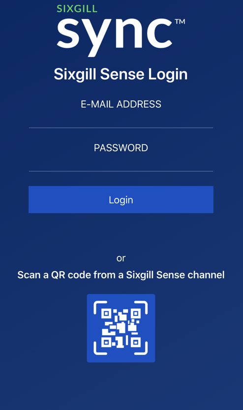
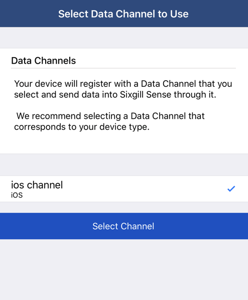

Sense 2.0 : Getting Started with Sense 2.0
==========================================

On-boarding users and devices in the Sense 2.0 platform

*   [Create a Sixgill Sense 2.0 account](#CreateAccount)
*   [Creating a Channel](#GettingStartedwithSense2.0-CreatingaChannel)
*   [Configuring a Channel for Push](#GettingStartedwithSense2.0-ConfiguringaChannelforPush)
*   [Connecting Devices](#GettingStartedwithSense2.0-ConnectingDevices)
    *   [iOS](#GettingStartedwithSense2.0-iOS)
    *   [Android](#GettingStartedwithSense2.0-Android)
    *   [IoT Devices](#GettingStartedwithSense2.0-IoTDevices)
*   [Creating a Rule](#GettingStartedwithSense2.0-CreatingaRule)
*   [Using the Sense API](#GettingStartedwithSense2.0-UsingtheSenseAPI)
*   [Related articles](#GettingStartedwithSense2.0-Relatedarticles)

Create a Sixgill Sense 2.0 account
----------------------------------

You will need an account to get started with Sixgill Sense.  

1.  Go to [sense-dashboard.sixgill.com](http://sense-dashboard.sixgill.com) and sign up for an account. You will be required to validate your email address.
    
2.  Once you are signed in, you can add other users to your account through the Admin tab.

Creating a Channel
------------------

A data Channel is a source of data that flows into the Sense platform. For example, a Channel could include all iOS devices with an app that uses the Sense Reach iOS SDK. Channels are collections of mobile apps that use the Sense SDKs, or of any other devices that write to the Sense Ingress API.

1.  Go to Channels
2.  Click on the type of channel you would like to create
    1.  Select **iOS Mobile Devices** to create a channel for iOS data for apps using the Sense Reach iOS SDK
    2.  Select **Android Mobile Devices** to create a channel for Android data for apps using the Sense Reach Android SDK
    3.  Select **IoT Devices** to create a channel for generic IoT data that will be sent using the Sense Ingress API
3.  Enter a name for your channel. Channel names must be unique to your account.

This will create a Channel for the type of data you wish to ingest.

Configuring a Channel for Push
------------------------------

TODO

Connecting Devices
------------------

Device sensor data is ingested into Sense 2.0 through the [Ingress API](http://docs.sixgill.com/ingress-api.html). For Android and iOS devices, this can be done by integrating the Sense SDK into a mobile app. The SDK handles sensor gathering at configurable intervals, and automatically sends the data to the Ingress API. The SDKs are authenticated using the API keys for the channel.

### iOS

Sense Reach iOS SDK v1.0.0 _(released March 9, 2018)_

[Sixgill Reach iOS SDK User Guide](http://docs.sixgill.com/ios-sdk-objc-docs/user-guide.html)

### Android

Sense Reach Android SDK v1.0.0 _(released March 9, 2018)_

[Sixgill Reach Android SDK User Guide](http://docs.sixgill.com/android-user-guide.html)

  

Users can also demo the mobile SDK capabilities by using the Sixgill Sync 2.0 demo application, available on the App Store and (coming soon) the Google Play Store.

Sixgill Sync 2.0 for iOS (link)

Sixgill Sync 2.0 for Android (link)

  

1.  Download the app on your device using the link above
2.  Login with your Sense 2.0 account credentials, OR use the QR code of the appropriate channel for this devices. iOS devices should use an **iOS Mobile Devices** Channel and Android devices should use an **Android Mobile Device** Channel

_Note: To get the QR code for your Channel, go to Channels and select the channel. The QR code is available next to the API key._

  

If using Sense 2.0 account credentials, you will be asked to select your project and channel.

3\. Your device is now connected to your Channel. The app will begin collection sensor data events for ingestion by the Sense platform.

  

### IoT Devices

The platform is able to ingest generic IoT sensor data. Developers will need to use the [Ingress API](http://docs.sixgill.com/ingress-api.html) to send data to the IoT events endpoint.

1.  Create an **IoT Devices** Channel if you do not have one already.
2.  **Data Mapping** may be required depending on the format of your sensor data. Contact [support@sixgill.com](mailto:support@sixgill.com) with any questions regarding setting up your channel.
3.  Use the Channel API keys to register your IoT device. Use the JSON Web Token in the response to authenticate your future requests.
4.  You can begin sending sensor data to the IoT events endpoint. See the IoT Events section of the [Ingress API](http://docs.sixgill.com/ingress-api.html) docs for more information.

  

Creating a Rule
---------------

Rules are at the heart of device interactivity within the Sense platform. Rules define conditions around devices and sensor data and specify the actions to trigger when the conditions are met. For example, devices entering a geofence or coming within range of a beacon could trigger a notification to another device, send an email to a recipient, or post data to another web service. Rules can be complex and perform multiple actions or include data from multiple channels.

  

Using the Sense API
-------------------

  

  

  

  

